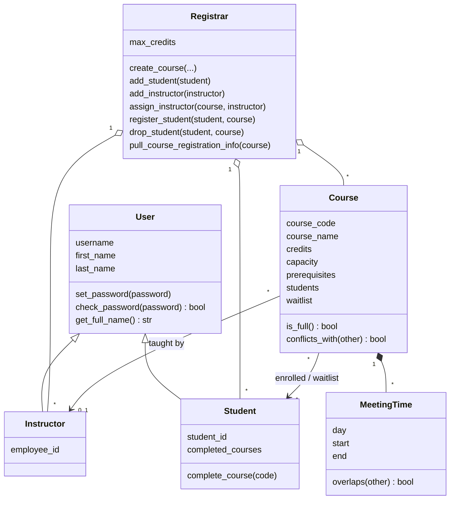

# Class Registration

[](https://github.com/AhmadRuman/Class-Registration/actions/workflows/ci.yml)

[](LICENSE)

A class registration system written in plain Python with no third-party dependencies.
It ships as a library and a `class-reg` command-line tool, and stores its data in SQLite.

## Features

- **Courses** with credits, seat limits, prerequisites and weekly meeting times
- **Waitlists**: full courses queue students in order, and a drop gives the seat to the
  first student on the waitlist who is still eligible
- **Registration rules**: completed prerequisites, a per-student credit limit and
  schedule conflict checks, each with a clear error message
- **Secure passwords**: only salted PBKDF2-SHA256 hashes are stored, never plain text
- **Saved in SQLite**: each save happens all at once or not at all, with foreign keys
  and a versioned schema
- **Command-line tool** for managing everything from the terminal

## Installation

```bash
git clone https://github.com/AhmadRuman/Class-Registration.git
cd Class-Registration
pip install .
```

This installs the `class-reg` command. You can also run it with `python -m class_registration`.

## Command-line usage

Data is stored in `registration.db` in the current directory. Use `--db PATH` or the
`CLASS_REG_DB` environment variable to choose a different file.

```console
$ class-reg init --max-credits 18
Database registration.db ready (max 18 credits per student)

$ class-reg course add CS101 "Intro to Programming" --credits 4 --capacity 30 \
    --meets "Mon 09:00-10:30" --meets "Wed 09:00-10:30"
Created CS101: Intro to Programming

$ class-reg course add CS201 "Algorithms" --prereq CS101 --meets "Tue 13:00-14:30"
Created CS201: Algorithms

$ class-reg instructor add E1 jdoe Jane Doe        # prompts for a password
$ class-reg instructor assign E1 CS101

$ class-reg student add S1 alice Alice Smith       # prompts for a password
$ class-reg register S1 CS201
error: Student S1 is missing prerequisites for CS201: CS101

$ class-reg student complete S1 CS101
$ class-reg register S1 CS201
Enrolled S1 in CS201

$ class-reg course list
CODE       NAME                           CREDITS     SEATS WAITLIST  INSTRUCTOR
CS101      Intro to Programming                 4      0/30        0  Jane Doe
CS201      Algorithms                           3       0/-        0  -
```

| Command | What it does |
|---|---|
| `init [--max-credits N]` | Create the database or change the credit limit |
| `course add CODE NAME [--credits N] [--capacity N] [--prereq CODE]... [--meets 'Mon 09:00-10:30']...` | Create a course |
| `course list` | List courses with seats, waitlist size and instructor |
| `course show CODE` | Course details, class list and waitlist |
| `instructor add ID USERNAME FIRST LAST` | Add an instructor |
| `instructor assign ID CODE` | Assign an instructor to a course |
| `student add ID USERNAME FIRST LAST` | Add a student |
| `student complete ID CODE...` | Record courses a student has completed |
| `student show ID` | A student's credits, schedule and waitlist positions |
| `register STUDENT_ID CODE` | Enroll a student, or add them to the waitlist if the course is full |
| `drop STUDENT_ID CODE` | Drop a student; the next eligible waitlisted student gets the seat |

When input is piped in rather than typed, passwords are read from standard input:
`echo "$PASSWORD" | class-reg student add ...`.

## Library usage

```python
from datetime import time
from class_registration import (
    ENROLLED,
    Instructor,
    MeetingTime,
    Registrar,
    Student,
    load_registrar,
    save_registrar,
)

registrar = Registrar(max_credits=18)
cs101 = registrar.create_course(
    "CS101",
    "Intro to Programming",
    credits=4,
    capacity=2,
    meeting_times=[MeetingTime("Mon", time(9), time(10, 30))],
)
registrar.assign_instructor(cs101, Instructor("jdoe", "s3cret", "Jane", "Doe", "E1"))

alice = Student("alice", "pw", "Alice", "Smith", "S1")
assert registrar.register_student(alice, cs101) == ENROLLED

print(registrar.pull_course_registration_info(cs101))
# {'Course Code': 'CS101', 'Course Name': 'Intro to Programming', 'Credits': 4,
#  'Capacity': 2, 'Instructor': 'Jane Doe', 'Registered Students': ['S1'], 'Waitlist': []}

save_registrar(registrar, "school.db")
registrar = load_registrar("school.db")
```

If a rule is broken, `RegistrationError` is raised (for example, missing prerequisites,
going over the credit limit, a schedule conflict, or a duplicate ID).

## Design



```
src/class_registration/
├── models.py       # User, Student, Instructor, Course, MeetingTime
├── registrar.py    # registration rules
├── storage.py      # SQLite save/load
├── exceptions.py   # RegistrationError
└── cli.py          # class-reg command
tests/              # unittest suite
```

## Development

```bash
pip install -e . ruff
python -m unittest discover -s tests   # run the tests
ruff check . && ruff format --check .  # lint and check formatting
```

On every push and pull request, CI runs lint plus the tests on Python 3.9–3.13 on Linux,
and on Python 3.13 on Windows and macOS.

## License

[MIT](LICENSE)
