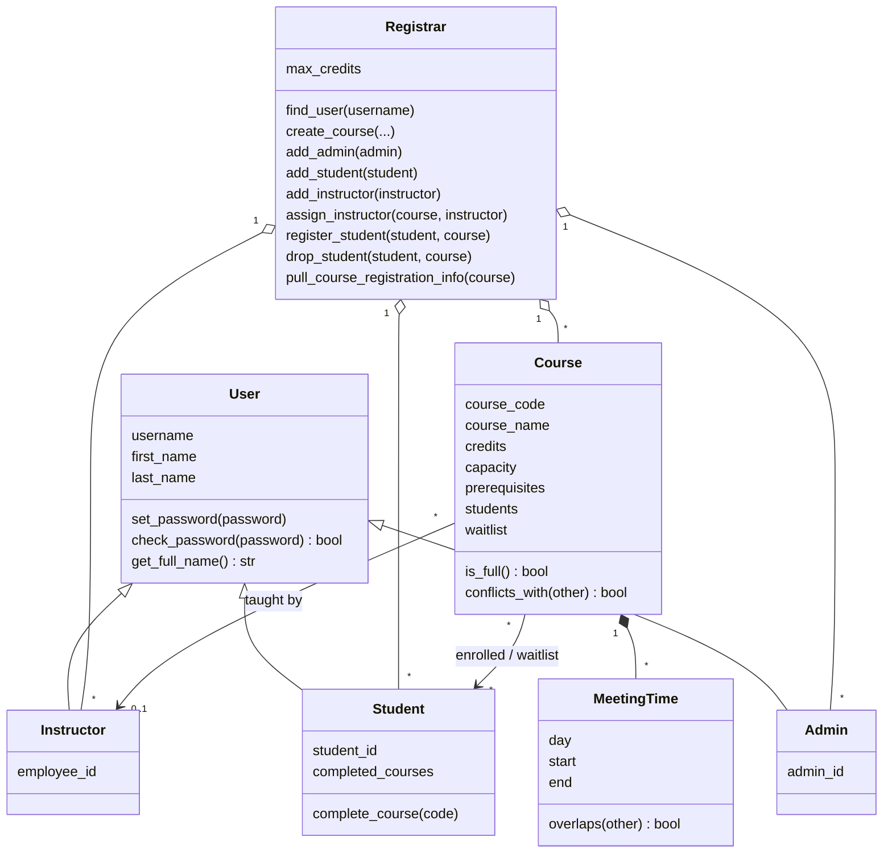

# Class Registration

[](https://github.com/AhmadRuman/Class-Registration/actions/workflows/ci.yml)

[](LICENSE)

A class registration system written in plain Python with no third-party dependencies.
It ships as a library and a `class-reg` command-line tool, and stores its data in SQLite.

**[Try it in your browser →](https://ahmadruman.github.io/Class-Registration/)** No install
needed: the playground runs the real `class-reg` program with
[Pyodide](https://pyodide.org) and comes with sample accounts for every role.

## Features

- **Courses** with credits, seat limits, prerequisites and weekly meeting times
- **Waitlists**: full courses queue students in order, and a drop gives the seat to the
  first student on the waitlist who is still eligible
- **Registration rules**: completed prerequisites, a per-student credit limit and
  schedule conflict checks, each with a clear error message
- **Logins and roles**: admins manage everything, instructors see the class lists of
  the courses they teach, and students register for and drop their own courses
- **Secure passwords**: only salted PBKDF2-SHA256 hashes are stored, never plain text.
  Login sessions expire after 8 hours, and only a hash of each session token is stored
- **Saved in SQLite**: each save happens all at once or not at all, with foreign keys
  and a versioned schema
- **Command-line tool** for managing everything from the terminal

## Installation

```bash
git clone https://github.com/AhmadRuman/Class-Registration.git
cd Class-Registration
pip install .
```

This installs the `class-reg` command. You can also run it with `python -m class_registration`.

## Command-line usage

Data is stored in `registration.db` in the current directory. Use `--db PATH` or the
`CLASS_REG_DB` environment variable to choose a different file.

### Getting started as an admin

A new database has no accounts, so the only command it accepts is creating the first
admin. After that, every command needs you to log in.

```console
$ class-reg admin add A1 root Ada Admin            # prompts for a password
Added admin Ada Admin (A1)

$ class-reg login root
Logged in as Ada Admin (admin)

$ class-reg init --max-credits 18
Database registration.db ready (max 18 credits per student)

$ class-reg course add CS101 "Intro to Programming" --credits 4 --capacity 30 \
    --meets "Mon 09:00-10:30" --meets "Wed 09:00-10:30"
Created CS101: Intro to Programming

$ class-reg course add CS201 "Algorithms" --prereq CS101 --meets "Tue 13:00-14:30"
Created CS201: Algorithms

$ class-reg instructor add E1 jdoe Jane Doe        # prompts for a password
$ class-reg instructor assign E1 CS101
$ class-reg student add S1 alice Alice Smith       # prompts for a password
```

### As a student

```console
$ class-reg login alice
Logged in as Alice Smith (student)

$ class-reg register CS201
error: Student S1 is missing prerequisites for CS201: CS101

$ class-reg register CS101
Enrolled S1 in CS101

$ class-reg student show                           # your own schedule
S1: Alice Smith (alice)
  Credits:   4/18
  Completed: -
  Enrolled:
    CS101  Intro to Programming (Mon 09:00-10:30, Wed 09:00-10:30)
```

### Who can do what

| Command | Admin | Instructor | Student |
|---|:-:|:-:|:-:|
| `login USERNAME`, `logout`, `whoami`, `passwd` | ✓ | ✓ | ✓ |
| `course list`, `course show CODE` | ✓ | ✓ | ✓ |
| ...with the class list and waitlist names | ✓ | own courses | – |
| `student show [ID]` | anyone | own students | self |
| `register CODE`, `drop CODE` | with `--student ID` | – | self |
| `student complete ID CODE...` | ✓ | own courses | – |
| `course add`, `instructor add/assign`, `student add`, `admin add`, `init` | ✓ | – | – |

### All commands

| Command | What it does |
|---|---|
| `admin add ID USERNAME FIRST LAST` | Add an admin (no login needed for the first one) |
| `login USERNAME` / `logout` / `whoami` | Start, end or check your session |
| `passwd` | Change your password; this also signs out your other sessions |
| `init [--max-credits N]` | Change the credit limit |
| `course add CODE NAME [--credits N] [--capacity N] [--prereq CODE]... [--meets 'Mon 09:00-10:30']...` | Create a course |
| `course list` | List courses with seats, waitlist size and instructor |
| `course show CODE` | Course details, plus the class list if you may see it |
| `instructor add ID USERNAME FIRST LAST` | Add an instructor |
| `instructor assign ID CODE` | Assign an instructor to a course |
| `student add ID USERNAME FIRST LAST` | Add a student |
| `student complete ID CODE...` | Record courses a student has completed |
| `student show [ID]` | A student's credits, schedule and waitlist positions |
| `register CODE [--student ID]` | Enroll, or join the waitlist if the course is full |
| `drop CODE [--student ID]` | Drop a course; the next eligible waitlisted student gets the seat |

Usernames are unique across admins, instructors and students. When input is piped in
rather than typed, passwords are read from standard input:
`echo "$PASSWORD" | class-reg login alice`.

Your login is remembered in `~/.class_reg_session` (or the file named by
`CLASS_REG_SESSION_FILE`), which only your user account can read.

### Upgrading from 0.1

Version 0.1 databases open without any changes, but they have no admin yet. Run
`class-reg admin add` once to create one. Note that `register` and `drop` now take the
course code first: `class-reg register CS101 --student S1`.

## Library usage

```python
from datetime import time
from class_registration import (
    ENROLLED,
    Instructor,
    MeetingTime,
    Registrar,
    Student,
    load_registrar,
    save_registrar,
)

registrar = Registrar(max_credits=18)
cs101 = registrar.create_course(
    "CS101",
    "Intro to Programming",
    credits=4,
    capacity=2,
    meeting_times=[MeetingTime("Mon", time(9), time(10, 30))],
)
registrar.assign_instructor(cs101, Instructor("jdoe", "s3cret", "Jane", "Doe", "E1"))

alice = Student("alice", "pw", "Alice", "Smith", "S1")
assert registrar.register_student(alice, cs101) == ENROLLED

print(registrar.pull_course_registration_info(cs101))
# {'Course Code': 'CS101', 'Course Name': 'Intro to Programming', 'Credits': 4,
#  'Capacity': 2, 'Instructor': 'Jane Doe', 'Registered Students': ['S1'], 'Waitlist': []}

save_registrar(registrar, "school.db")
registrar = load_registrar("school.db")
```

If a rule is broken, `RegistrationError` is raised (for example, missing prerequisites,
going over the credit limit, a schedule conflict, or a duplicate ID).

The `Registrar` only enforces registration rules. Logins and permissions live in
`class_registration.auth`, so an app built on the library decides who may call what:

```python
from class_registration import STUDENT, authenticate, role_of
from class_registration.auth import can_view_roster

user = authenticate(registrar, "alice", "pw")  # raises AuthenticationError if wrong
assert role_of(user) == STUDENT
assert not can_view_roster(user, registrar.courses["CS101"])
```

## Design



```
src/class_registration/
├── models.py       # User, Admin, Student, Instructor, Course, MeetingTime
├── registrar.py    # registration rules
├── auth.py         # login and role permissions
├── storage.py      # SQLite save/load and login sessions
├── exceptions.py   # RegistrationError, AuthenticationError, PermissionDenied
└── cli.py          # class-reg command
tests/              # unittest suite
```

## Online playground

The `site/` folder is a single-page playground that runs this package in the browser
with Pyodide (Python compiled to WebAssembly). On every push to `main`, the
`Deploy playground` workflow bundles `src/class_registration` into
`site/app-source.json` and publishes the folder to GitHub Pages, so the playground
always runs the current code. To try it locally:

```bash
python site/build.py
python -m http.server --directory site 8000   # then open http://localhost:8000
```

## Development

```bash
pip install -e . ruff
python -m unittest discover -s tests   # run the tests
ruff check . && ruff format --check .  # lint and check formatting
```

On every push and pull request, CI runs lint plus the tests on Python 3.9–3.13 on Linux,
and on Python 3.13 on Windows and macOS.

## License

[MIT](LICENSE)
